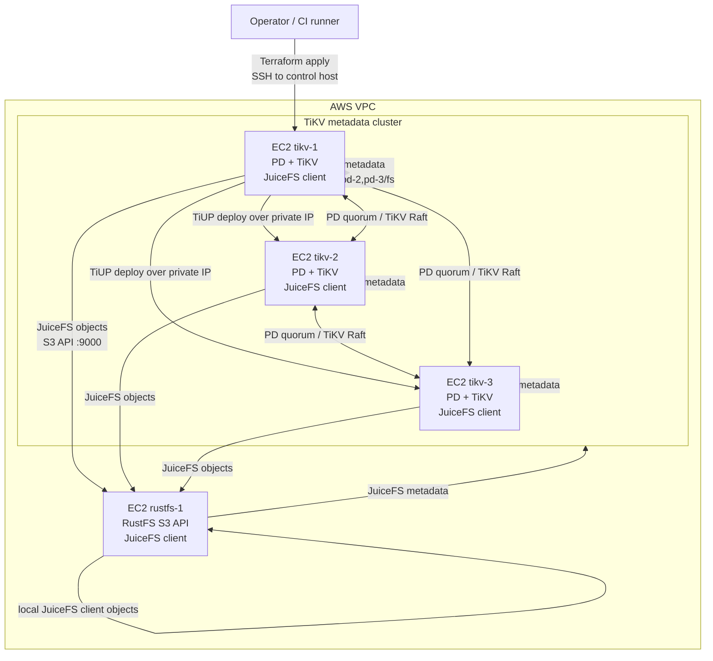

# AWS deployment steps

这份文档是仓库的端到端执行手册，用 Terraform 在 AWS 创建 4 台 EC2：

- 3 台 `PD + TiKV + JuiceFS client`
- 1 台 `RustFS + JuiceFS client`
- JuiceFS metadata 写入 TiKV，object data 写入 RustFS S3 API
- 4 台机器都可参与 JuiceFS metadata test，默认总目标约 1 亿小文件

实际部署时，TiUP 会从第一台 TiKV 节点公网 IP 进入 VPC，再使用私网 IP 部署 3 节点 TiKV 集群。

## Architecture



## 1. 前置条件

本地控制机需要：

- AWS credential 已配置好，例如 `AWS_PROFILE`、`AWS_ACCESS_KEY_ID` 或实例角色。
- Terraform `>= 1.5`。
- 能从当前公网出口 SSH 到 EC2。把你的办公网或 VPN CIDR 写入 `allowed_ssh_cidrs`。
- 本地有 `curl`，用于自动探测公网 IP；有 `openssl` 时会优先用于生成随机密钥。
- AWS 配额足够创建 4 台实例、4 块数据盘和 gp3 IOPS/throughput。
- 不要把真实 `terraform.tfvars`、生成的 env、state、pem 文件提交到仓库。

## 2. 配置 Terraform

最省事的入口是全自动部署脚本：

```bash
scripts/aws_full_deploy.sh deploy
```

它会自动生成 `terraform.tfvars`、执行 `terraform init/apply`、等待 4 台节点初始化、部署 `3 PD + 3 TiKV`，并初始化 JuiceFS。

如果只想先创建 4 台 EC2 并等 cloud-init 完成，不部署 TiKV、不初始化 JuiceFS：

```bash
scripts/aws_full_deploy.sh provision
```

`provision` 完成后，连接配置和私钥集中在 `run/<project>/`：

```text
run/slayerfs-rustfs/
  juicefs-aws.env
  slayerfs-rustfs.pem
  topology.aws.generated.yaml
```

机器准备好后再继续部署：

```bash
scripts/aws_full_deploy.sh deploy-existing
```

如果你已经手工或用其他工具创建了 4 台机器，并且本机可以直接通过 SSH alias 连接：

```bash
ssh aws1
ssh aws2
ssh aws3
ssh aws4
```

则可以让脚本从这些别名生成后续部署配置：

```bash
scripts/aws_full_deploy.sh ssh-env
scripts/aws_full_deploy.sh bootstrap-existing
scripts/aws_full_deploy.sh deploy-existing
```

默认约定：

- `aws1`、`aws2`、`aws3` 作为 `PD + TiKV` 节点。
- `aws4` 作为 RustFS 节点。
- `ssh-env` 会探测各节点内网 IP，生成 `run/<project>/juicefs-aws.env` 和 `run/<project>/topology.ssh-alias.generated.yaml`。
- 如果节点上已有 `/data/rustfs1` 这类测试数据盘，`ssh-env` 默认把 TiKV 放到 `/data/rustfs1/tikv`，把 JuiceFS cache 放到 `/data/rustfs2/juicefs-cache`。可用 `TIKV_DATA_ROOT`、`CACHE_DIR` 覆盖。
- 默认会生成 `run/<project>/ssh-alias-deploy-key`，并把公钥追加到 4 台机器的 `authorized_keys`，这样控制机 `aws1` 可以继续通过内网 IP 部署 TiKV。
- 如果 `aws4:/etc/default/rustfs` 读不到 RustFS 密钥，需要用 `RUSTFS_SECRET_KEY=... scripts/aws_full_deploy.sh ssh-env` 显式传入。

如果 RustFS 已在外部 endpoint 上运行，4 台现有机器只需要承担 `3 TiKV + 4 JuiceFS client`：

```bash
SSH_HOSTS="vm008 vm009 vm010 vm011" \
TIKV_HOSTS="vm008 vm009 vm010" \
CONTROL_HOST=vm008 \
INSTALL_CONTROL_SSH_KEY=0 \
RUSTFS_ENDPOINT="http://<rustfs-endpoint>:9000" \
RUSTFS_ACCESS_KEY="<access-key>" \
RUSTFS_SECRET_KEY="<secret-key>" \
FORCE=1 \
scripts/aws_full_deploy.sh ssh-env

scripts/aws_full_deploy.sh bootstrap-existing
scripts/aws_full_deploy.sh deploy-existing
```

如果希望先只生成配置再检查，使用：

```bash
scripts/aws/generate_aws_tfvars.sh
```

脚本会自动：

- 探测当前公网 IP，并写入 `allowed_ssh_cidrs = ["<ip>/32"]`。
- 生成 32 位 shell-safe `rustfs_secret_key`。
- 写出 `terraform/aws/terraform.tfvars`，权限设为 `0600`。

生成后可以按需查看和调整：

```bash
vi terraform/aws/terraform.tfvars
```

常用覆盖方式：

```bash
AWS_REGION=us-west-2 \
PROJECT_NAME=slayerfs-rustfs \
ALLOWED_SSH_CIDRS="203.0.113.10/32,198.51.100.20/32" \
TIKV_INSTANCE_TYPE=i4i.2xlarge \
RUSTFS_INSTANCE_TYPE=i4i.2xlarge \
scripts/aws/generate_aws_tfvars.sh
```

默认 `DEPLOY_PROFILE=dev`，用于低成本部署验证。亿级压测使用：

```bash
DEPLOY_PROFILE=stress scripts/aws/generate_aws_tfvars.sh
```

如果文件已存在，脚本默认拒绝覆盖。确认要重建时：

```bash
FORCE=1 scripts/aws/generate_aws_tfvars.sh
```

关键配置示例：

```hcl
aws_region = "us-east-1"
project_name = "slayerfs-rustfs"

allowed_ssh_cidrs = ["自动探测到的公网出口/32"]
expose_rustfs_console = false

rustfs_secret_key = "脚本自动生成的随机字符串"
rustfs_bucket = "juicefs-prod"
jfs_name = "juicefs-prod"
```

默认会创建新的 EC2 key pair，并把私钥写入 `run/<project>/<project>.pem`：

```hcl
create_key_pair = true
```

如果使用已有 key pair，改成：

```hcl
create_key_pair = false
key_name = "my-existing-key"
ssh_private_key_path = "/absolute/path/to/my-existing-key.pem"
```

`dev` 档默认配置：

```hcl
tikv_instance_type = "m6i.xlarge"
rustfs_instance_type = "m6i.xlarge"

tikv_data_volume_size_gb = 512
rustfs_data_volume_size_gb = 1024
tikv_raftstore_capacity = "" # auto: tikv data disk - 128GiB
data_volume_type = "gp3"
data_volume_iops = 3000
data_volume_throughput = 125

target_total_files = 1000000
files_per_dir = 10000
test_threads = 64
```

亿级压测档 `DEPLOY_PROFILE=stress` 会生成：

```hcl
tikv_instance_type = "m6i.2xlarge"
rustfs_instance_type = "m6i.2xlarge"

tikv_data_volume_size_gb = 2048
rustfs_data_volume_size_gb = 4096
tikv_raftstore_capacity = "" # auto: tikv data disk - 128GiB
data_volume_type = "gp3"
data_volume_iops = 12000
data_volume_throughput = 500

target_total_files = 100000000
files_per_dir = 100000
test_threads = 256
```

## 3. 创建 AWS 资源

如果没有使用 `scripts/aws_full_deploy.sh deploy`，可以手动执行 Terraform：

```bash
terraform -chdir=terraform/aws init
terraform -chdir=terraform/aws apply
```

Terraform 会生成这些部署文件：

- `run/<project>/juicefs-aws.env`
- `run/<project>/topology.aws.generated.yaml`
- `run/<project>/<project>.pem`，仅当 `create_key_pair=true`

可以用 Terraform output 核对地址：

```bash
terraform -chdir=terraform/aws output
```

## 4. 加载部署环境

在仓库根目录加载 Terraform 生成的环境变量：

```bash
set -a
. run/slayerfs-rustfs/juicefs-aws.env
set +a
```

关键变量包括：

- `CONTROL_HOST`：第一台 TiKV 节点公网 IP，作为 VPC 内控制机。
- `JUICEFS_TEST_HOSTS`：4 台节点公网 IP，用于等待 cloud-init 和并发压测。
- `TOPOLOGY`：TiUP topology 文件。
- `META_URL`：JuiceFS 使用的 TiKV metadata URL。
- `JFS_BUCKET`：RustFS S3 bucket URL。
- `SSH_USER` 和 `SSH_KEY`：登录 EC2 的用户和私钥。SSH alias 模式下 `SSH_KEY` 可以由 `ssh-env` 自动生成，也可以留空使用 SSH config。

## 5. 部署 TiKV 并初始化 JuiceFS

如果没有使用总控脚本，运行部署脚本：

```bash
scripts/aws/run_aws_deploy.sh
```

这个脚本会执行：

- 等待 4 台机器 cloud-init 完成，并确认 JuiceFS 二进制已安装。
- 把 TiUP 安装脚本、TiKV 部署脚本、JuiceFS format 脚本、topology 和可选 SSH key 临时复制到 `CONTROL_HOST`。
- 在 VPC 内使用私网 IP 部署 `3 PD + 3 TiKV`。
- 在控制机和 4 台客户端安装或刷新 JuiceFS 二进制。
- 使用 RustFS S3 API 初始化 JuiceFS。
- 在 4 台节点上安装并启动 JuiceFS mount systemd 服务，默认挂载到 `MOUNT_POINT=/mnt/<jfs_name>`。
- 退出时删除远端临时 key 和 env。

如果只想先等待节点初始化完成，可以单独执行：

```bash
scripts/aws/wait_aws_nodes.sh
```

## 6. 运行亿级小文件 metadata test

执行 4 节点并发测试：

```bash
scripts/aws_full_deploy.sh test
```

默认会生成本地报告目录：

```text
reports/metadata/<run-id>/
  summary.md
  summary.kv
  hosts.tsv
  nodes/<host>/result.kv
  nodes/<host>/stdout.log
  nodes/<host>/stderr.log
  nodes/<host>/pre-node-info.log
  nodes/<host>/post-node-info.log
```

其中 `summary.md` 聚合多个 JuiceFS 客户端的估算文件数、单节点耗时和整体 files/s；`summary.kv` 方便后续脚本读取。每个节点目录保存远端 stdout/stderr、执行结果 KV、测试前后的系统状态、`juicefs status`、`df`、进程列表和可用时的 `iostat`。

也可以直接调用底层脚本：

```bash
scripts/test/run_metadata_test_all_nodes.sh
```

默认参数来自 `run/<project>/juicefs-aws.env`：

```bash
TARGET_FILES_PER_NODE=25000000
FILES_PER_DIR=100000
THREADS=256
DEPTH=2
WRITE_SIZE=1
```

`scripts/test/run_metadata_test.sh` 会根据 `FILES_PER_DIR`、`THREADS` 和 `DEPTH` 计算 JuiceFS `mdtest` 参数。由于目录树需要取整，默认配置每台实际估算约创建 `27,326,208` 个文件，4 台合计约 `109,304,832` 个文件，满足亿级小文件目标。

临时调小规模验证可以覆盖环境变量：

```bash
TARGET_FILES_PER_NODE=1000000 \
FILES_PER_DIR=10000 \
THREADS=64 \
scripts/test/run_metadata_test_all_nodes.sh
```

也可以追加 JuiceFS mdtest 参数：

```bash
EXTRA_MDTEST_ARGS="--rand" scripts/test/run_metadata_test_all_nodes.sh
```

如果中途有节点失败，保留同一个 `TEST_RUN_ID` 后续跑即可。已经成功并有 `result.kv` 的节点会被跳过；失败节点会用新的 per-node retry 目录重跑，避免 mdtest 受残留目录影响：

```bash
TEST_RUN_ID=20260701-010203 \
REPORT_DIR=reports/metadata/20260701-010203 \
RESUME_TEST=1 \
scripts/aws_full_deploy.sh test
```

## 7. 运行小文件写入测试并生成报告

metadata test 更偏元数据路径；如果要通过已挂载的 JuiceFS 尽可能写入大量真实小文件，运行：

```bash
scripts/aws_full_deploy.sh write-test
```

这个命令会：

- 读取 `run/<project>/juicefs-aws.env`。
- 并发登录 `JUICEFS_TEST_HOSTS` 中的 4 台节点。
- 在每台节点的 `MOUNT_POINT` 下创建多 worker 小文件写入任务。
- 收集每台节点的 `files_created`、`files_skipped`、`files_present`、`bytes_created`、`elapsed_seconds`、`files_per_second`、`mb_per_second` 和错误数。
- 在本地生成 Markdown 报告，默认路径为 `reports/file-write/<run-id>/summary.md`。
- 在 `reports/file-write/<run-id>/nodes/<host>/` 下保存远端 stdout/stderr、结果 KV、测试前后节点状态和可用时的 `iostat`。

常用参数：

```bash
FILE_WRITE_TOTAL_FILES=100000000 \
FILE_WRITE_SIZE_BYTES=1 \
FILE_WRITE_WORKERS=256 \
FILES_PER_DIR=100000 \
scripts/aws_full_deploy.sh write-test
```

也可以显式指定每台节点写入数量：

```bash
FILE_WRITE_TARGET_PER_NODE=25000000 \
FILE_WRITE_SIZE_BYTES=1 \
FILE_WRITE_WORKERS=256 \
FILES_PER_DIR=100000 \
scripts/aws_full_deploy.sh write-test
```

优先级为：`FILE_WRITE_TARGET_PER_NODE` 强制单节点数量最高；未设置它时，`FILE_WRITE_TOTAL_FILES` 会按节点数自动平分；两者都未设置时才使用 env 中的 `TARGET_FILES_PER_NODE`。

写入测试目录前缀默认是 `filewrite`；如需自定义，使用 `FILE_WRITE_TEST_PREFIX=my-write-test`。metadata test 可以用 `METADATA_TEST_PREFIX` 或 `TEST_PREFIX` 覆盖目录前缀。

如果希望按时间尽量写入，而不是固定文件数，可以设置最大运行秒数：

```bash
FILE_WRITE_TARGET_PER_NODE=1000000000 \
FILE_WRITE_MAX_SECONDS=3600 \
FILE_WRITE_WORKERS=256 \
scripts/aws_full_deploy.sh write-test
```

每次测试会在挂载点下创建形如 `filewrite-<host>-<timestamp>` 的目录。报告会记录每台机器的具体测试目录，清理前先确认不再需要这些文件。

如果写入测试中断，使用相同 `TEST_RUN_ID` 和 `RESUME_TEST=1` 继续。脚本会复用同名测试目录，跳过已经存在且大小等于 `FILE_WRITE_SIZE_BYTES` 的文件，只补写缺失文件：

```bash
TEST_RUN_ID=20260701-010203 \
REPORT_DIR=reports/file-write/20260701-010203 \
RESUME_TEST=1 \
FILE_WRITE_TARGET_PER_NODE=25000000 \
scripts/aws_full_deploy.sh write-test
```

续跑报告里：

- `Created` 表示本次新写入文件数。
- `Reused` 表示续跑时识别到的已存在文件数。
- `Present` 表示该节点目录内本轮目标范围内最终具备的文件数。

### 查看运行中进度

常规进度检查只看远端 pid、进程状态、stderr 尾部、JuiceFS 挂载点容量和 cache 目录容量：

```bash
TEST_RUN_ID=20260701-010203 scripts/aws_full_deploy.sh write-progress
```

如果要精确统计当前批次已经写入多少文件，开启 `EXACT_COUNT=1`：

```bash
TEST_RUN_ID=20260701-010203 \
EXACT_COUNT=1 \
scripts/aws_full_deploy.sh write-progress
```

精确统计会对 JuiceFS 目录执行 `find`，会额外消耗 metadata 能力。长时间压测时建议 10-30 分钟看一次，不要高频轮询。

RustFS 后端磁盘也可以一起采集。如果后端节点只能从跳板机登录，使用 `RUSTFS_BACKEND_JUMP_TARGET`：

```bash
TEST_RUN_ID=20260701-010203 \
RUSTFS_BACKEND_HOSTS="vm001 vm002 vm003" \
RUSTFS_BACKEND_JUMP_TARGET=juicefs-bastion \
scripts/aws_full_deploy.sh write-progress
```

远端 detached 运行或本地会话断开后，测试完成时拉回结果并重建本地报告：

```bash
TEST_RUN_ID=20260701-010203 scripts/aws_full_deploy.sh collect-write-results
```

## 8. 常用检查

在控制机查看 TiKV 集群：

```bash
ssh -i "$SSH_KEY" "$SSH_USER@$CONTROL_HOST"
tiup cluster display "$CLUSTER_NAME"
tiup cluster status "$CLUSTER_NAME"
```

在任意节点查看 JuiceFS：

```bash
juicefs status "$META_URL"
juicefs info "$META_URL" /
```

RustFS service 在第 4 台节点上，默认 S3 API 监听 `9000`。RustFS console 端口 `9001` 默认不开放公网；只有设置 `expose_rustfs_console = true` 后才会对 `allowed_ssh_cidrs` 放行。

## 9. 清理资源

确认不再需要压测数据后销毁 AWS 资源：

```bash
CONFIRM_DESTROY=1 scripts/aws_full_deploy.sh destroy
```

默认仍会使用 `terraform destroy -auto-approve`；如果希望 Terraform 逐项确认：

```bash
CONFIRM_DESTROY=1 AUTO_APPROVE=0 scripts/aws_full_deploy.sh destroy
```

本地生成文件在 `.gitignore` 中已忽略，可按需删除：

```bash
rm -rf terraform/aws/.terraform terraform/aws/terraform.tfstate terraform/aws/terraform.tfstate.backup run/<project>
```

## 10. 排障

cloud-init 或二进制安装失败时，登录对应节点查看：

```bash
sudo tail -200 /var/log/cloud-init-output.log
sudo systemctl status rustfs
```

`scripts/aws/run_aws_deploy.sh` 无法 SSH 时，优先检查：

- `allowed_ssh_cidrs` 是否包含当前公网出口。
- `SSH_KEY` 指向的私钥是否存在且权限正确。
- `SSH_USER` 是否匹配 AMI，默认 Ubuntu AMI 使用 `ubuntu`。
- 安全组是否允许 `22`、VPC 内是否允许 `2379`、`2380`、`20160`、`20180`、`9000`。

JuiceFS format 失败时，优先检查 RustFS：

- 第 4 台节点 `rustfs` systemd service 是否 running。
- `RUSTFS_ACCESS_KEY`、`RUSTFS_SECRET_KEY` 是否与 Terraform 配置一致。
- `RUSTFS_BUCKET` 是否已创建。
- `JFS_BUCKET` 是否形如 `http://<rustfs-private-ip>:9000/<bucket>`。
